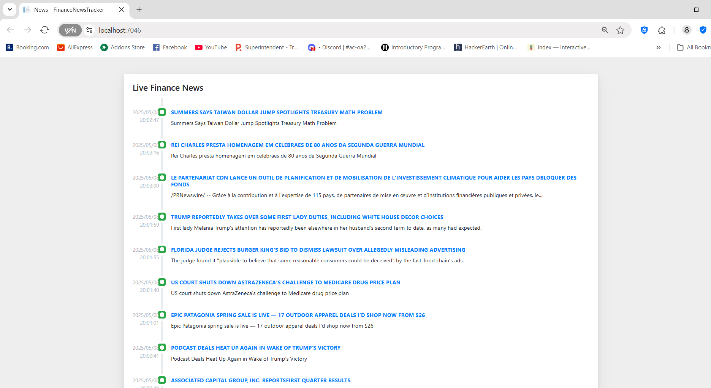

# FinanceNewsTracker

# 📈 Finance News Ticker (ASP.NET 6 Web Application)




This project is a **Finance News Tracker** built with **ASP.NET 8**, displaying the latest financial headlines using the [APILayer Finance News API](https://apilayer.com/marketplace/finance-news-api). It includes custom CSS and auto-refreshes every 20 seconds.

## ✨ Features

- 🔁 Auto-refreshing finance news ticker (every 20 seconds)
- 🎨 Custom styled frontend with CSS
- 🌐 RESTful API integration using APILayer
- 🔎 News filtering via keywords, tags, dates, and tickers

---

## 🚀 Getting Started

### ✅ Prerequisites

- [.NET 6 SDK](https://dotnet.microsoft.com/en-us/download/dotnet/6.0)
- API key from [APILayer Finance News API](https://apilayer.com/marketplace/finance-news-api)
- IDE (e.g. Visual Studio, Visual Studio Code)

### 🛠️ Setup Instructions

1. **Clone the repository:**

   ```bash
   https://github.com/ThobMvuni/FinanceNewsTracker.git
   cd FinanceNewsTracker

2. **Configure your API key::**

   Open appsettings.json and add your API key:

   {
  "FinanceNewsApiKey": "YOUR_API_KEY_HERE"
}

3. **Run the application::**
   dotnet run

4. **View in browser:**

   https://localhost:5001

**📄 License**

This project is licensed under the MIT License.
🙋‍♀️ How does the Finance News API help?

**The API provides:**

    Real-time and historical financial news

    Scalable infrastructure and JSON responses

    Filter options for more targeted results


